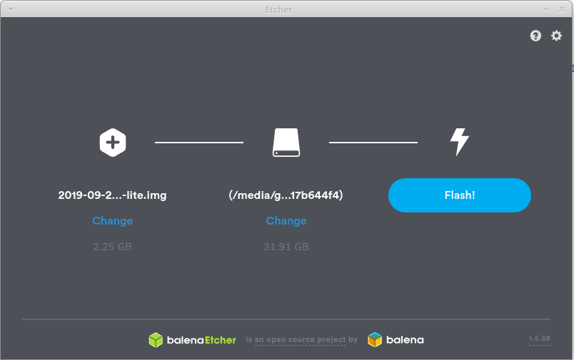
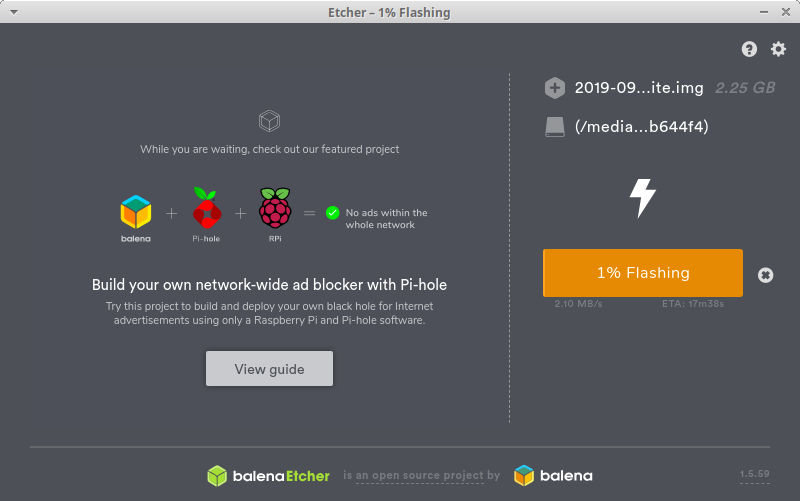
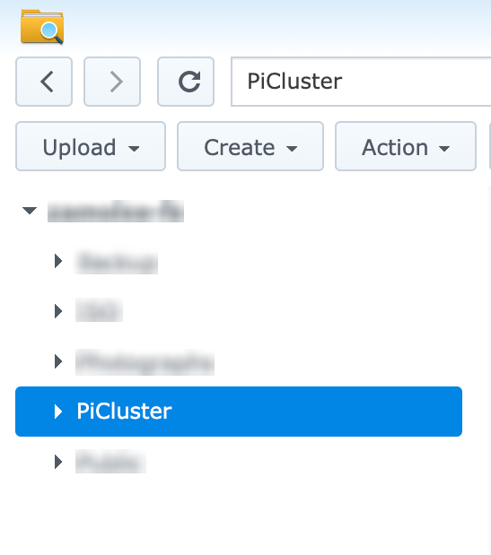
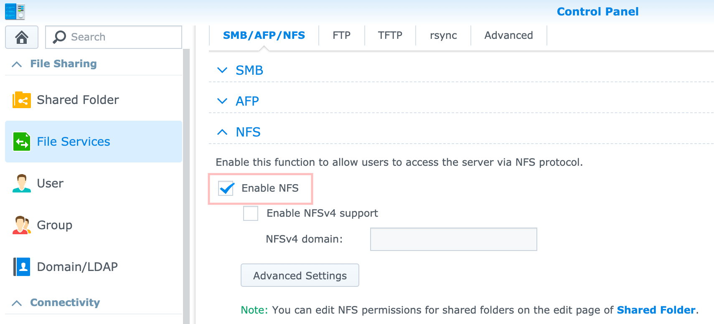
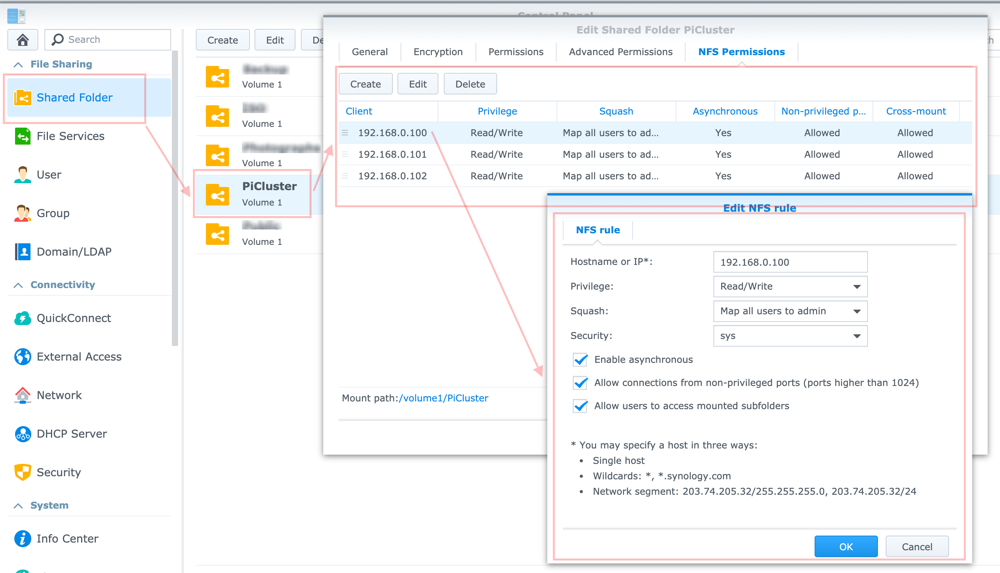

# Personal Pi Cluster

At the moment its main purpose is to run a media center and some dev tools.

The follwing guide assumes everything will be done manually. Hopefully in the future this could be provisioned using Ansible or at least a script.

## Requirements

- TODO

## Architecture

- TODO

## Setup Steps

### (1/8) Pi setup

#### Install OS and prepare the system for Kubernetes

Fist of all, we need to install and configure the Linux Operating System on each node of the future Kubernetes cluster.

Our cluster will be composed of 3 (at the time of writing I had 3) machines.

| Hostname | IP | Description |
| -------- | -- | ----------- |
| kube-master | 192.168.0.100 | A Master represents the main node of the cluster responsible of the orchestration. It can act as a worker as well and run applications |
| kube-worker1 | 192.168.0.101 | A Worker is a machine dedicated to run applications only. It is remotely managed by the master node |
| kube-worker2 |192.168.0.102 | A Worker is a machine dedicated to run applications only. It is remotely managed by the master node |

> NOTE: 192.168.0.100 101 102 are the IP addresses I used on my cluster. Based on the network setup, these values could be different.

#### Flash the OS on the Micro SD card

1. Download the latest version of the Raspbian Linux / Ubuntu OS for RaspberryPi

Go to [the download page](https://www.raspberrypi.org/downloads/raspbian/) and download Raspbian Buster Lite.

Raspbian is a Debian-based computer operating system for Raspberry Pi.
Buster Lite is a minimal version of Raspbian that doesn't contain a Desktop or Recommended software. We can start from a very clean, light and fresh install using this version.

> [Ubuntu for IOT](https://ubuntu.com/download/raspberry-pi) can be used also. Ubuntu also has support fo x64.

2. Unzip the archive to obtain the image {name}.img

3. Plug an Micro SD Card into your local machine

4. Use Etcher and flash the image on the SD card

Download [Etcher](https://www.balena.io/etcher/) to flash OS images to SD cards & USB drives, safely and easily.

Launch Etcher, select first the image extracted of Raspbian, select the Media (SD card) and click on Flash.





5. Once flashed, navigate to the folder /boot of the SD card and create an empty file ssh

Adding the file named `ssh` onto the boot partition enables SSH by default.

```shell
cd /media/<USER_ID>/boot
touch ssh
```

6. Unplug the Micro SD Card from your local machine and plug it to the Raspberry Pi

7. Plug the power to the Raspberry Pi as well as an Ethernet cable

#### Power up and connect via SSH

1. Determine the device IP address

You can use your router or https://angryip.org/ or any IP discovery app you want.

2. Connect via SSH to the machine

> The default password after a fresh Raspbian installation is raspberry (this will be change after this step).

```shell
ssh pi@192.168.0.100
```

Test the other machines to make sure everything works.

#### Configure the OS

Before starting installing the Kubernetes cluster, we need to run a few common steps and security checks.

> THE FOLLOWING STEPS (6/6) SHOULD BE RUN ON ALL MACHINES

##### (1/6) Change password

```
pi@raspberrypi:~ passwd

Changing password for pi.
Current password: raspberry
New password: <new_password>
Retype new password: <new_password>
passwd: password updated successfully
```

##### (2/6) Change hostname

The default machine hostname is raspberrypi, keeping this could be quite confusing when we'd have two more machines with the same name. To change the hostname, two files needs to be edited:

1. Edit the file `/etc/hostnam`e and replace raspberrypi by `kube-master` or `kube-worker-x`.

```shell
sudo nano /etc/hostname

# kube-master or kube-worker-1,2...
```

2. Edit the file `/etc/hosts` and replace raspberrypi (line 6) by kube-master or kube-worker-x

```
pi@raspberrypi:~ $ sudo nano /etc/hosts

127.0.0.1       localhost
::1             localhost ip6-localhost ip6-loopback
ff02::1         ip6-allnodes
ff02::2         ip6-allrouters

127.0.1.1       kube-master
```

###### (3/6) Upgrade the system

To make sure, the system is up-to-date, run the following command to download the latest update and security patches.

> This step might take a few minutes.

```shell
sudo apt-get update && sudo apt-get upgrade -y
```

##### (4/6) Configure a static IP

By default, the router assigns a arbitrary IP address to the device which means it is highly possible that the router will assign a new different IP address after a reboot. To avoid to recheck our router, it is possible to assign a static IP to the machine.

Edit the file `/etc/dhcpcd.conf` and add the four lines below:

```
pi@raspberrypi:~ $ sudo nano /etc/dhcpcd.conf

interface eth0
static ip_address=192.168.0.{value}/24
static routers=192.168.0.1
static domain_name_servers=1.1.1.1
```

> Replace `{value}` with the machine IP address, ex: `static ip_address=192.168.0.100/24`

> The same should be done at router level. Block / Lock the IP address so that other devices could not get it from DHCP.

##### (5/6) Enable container features

We need to enable container features in the kernel in order to run containers.

Edit the file `/boot/cmdline.txt`:

```shell
sudo nano /boot/cmdline.txt
```

and add the following properties at the end of the line:

```
cgroup_enable=cpuset cgroup_memory=1 cgroup_enable=memory
```

##### (6/6) Restart and connect to the static IP with the new password and check the hostname.

```
pi@raspberrypi:~ $ sudo reboot

Connection to 192.168.0.22 closed by remote host.
Connection to 192.168.0.22 closed.
```

Reconnect after a few seconds

```
ssh pi@192.168.0.100
pi@192.168.0.22's password: <new_password>
```

Check if the hostname has been updated

```
pi@kube-master:~ $ hostname

kube-master
```

#### Configure the disk share (NFS)

If we need to connect a SSD to the master node and share it via NFS follow [these guidelines](https://kauri.io/install-raspbian-operating-system-and-prepare-the-system-for-kubernetes/7df2a9f9cf5f4f6eb217aa7223c01594/a) Configure the SSD disk share.

Bellow are details on how to set a NFS share on a Synology NAS for all machines.

> THE FOLLOWING STEPS (6/5) SHOULD BE RUN ON ALL MACHINES

##### (1/5) Create a mount folder

The NFS share will need a folder to be mounted on. Create the directory `/mnt/ssd` and set the ownership to `pi`.

```shell
sudo mkdir /mnt/ssd
sudo chown -R pi:pi /mnt/ssd/
```

##### (2/5) Create a NFS shared folder in Synology

Create a shared folder that will be used to host all filea coming from our cluster.



Enable NFS in File Services if not already done.



Under the shared folder properties set the NFS permissions for each machine individually making sure we set the correct properties as seen bellow.



##### (3/5) Install the necessary dependencies

```shell
sudo apt-get install nfs-common -y
```

##### (4/5) Configure auto-mount of the NFS Share

In this step, we will edit `/etc/fstab` to tell the OS to automatically mount the NFS share into the directory `/mnt/ssd` when the machine starts.

```shell
sudo nano /etc/fstab
```

Add the following line where `192.168.0.8:/volume1/PiCluster` is the IP of the NAS and the NFS share path.

```
192.168.0.8:/volume1/PiCluster   /mnt/ssd   nfs    rw  0  0
```

> For Synology all shared folders are located under `/volume1/{name of the folder}`

It should looks like this:

```
proc            /proc           proc    defaults          0       0
PARTUUID=738a4d67-01  /boot           vfat    defaults          0       2
PARTUUID=738a4d67-02  /               ext4    defaults,noatime  0       1
# a swapfile is not a swap partition, no line here
#   use  dphys-swapfile swap[on|off]  for that
192.168.0.8:/volume1/PiCluster   /mnt/ssd   nfs    rw  0  0
```

##### (5/5) Reboot the system

```shell
sudo reboot
```

### (2/8) Install and configure a Kubernetes cluster with k3s

Once the cluster is up and each node connected to each other, we will install some useful services such as:

* [Helm](https://helm.sh/): Package manager for Kubernetes
* [MetalLB](https://metallb.universe.tf/): Load-balancer implementation for bare metal Kubernetes clusters
* [Nginx](https://github.com/kubernetes/ingress-nginx): Kubernetes Ingress Proxy
* [Cert Manager](https://cert-manager.io/): Native Kubernetes certificate management controller.
* [Kubernetes Dashboard](https://kubernetes.io/docs/tasks/access-application-cluster/web-ui-dashboard/): A web-based Kubernetes user interface

#### Install k3s server (MASTER NODE)

1. Connect via ssh to the master node

```
ssh pi@192.168.0.100
```

2. Configure the following environment variables

The first line specifies in which mode we would like to write the k3s configuration (required when not running commands as root). The second line says k3s not to deploy its default load balancer named servicelb and proxy traefik.

Instead we will install manually `metalb` as load balancer and `nginx` as proxy.

```
export K3S_KUBECONFIG_MODE="644"
export INSTALL_K3S_EXEC=" --no-deploy servicelb --no-deploy traefik"
```

3. Run the installer

```shell
curl -sfL https://get.k3s.io | sh -
```

```
[INFO]  Finding latest release
[INFO]  Using v1.17.0+k3s.1 as release
[INFO]  Downloading hash https://github.com/rancher/k3s/releases/download/v1.17.0+k3s.1/sha256sum-arm.txt
[INFO]  Downloading binary https://github.com/rancher/k3s/releases/download/v1.17.0+k3s.1/k3s-armhf
[INFO]  Verifying binary download
[INFO]  Installing k3s to /usr/local/bin/k3s
[INFO]  Creating /usr/local/bin/kubectl symlink to k3s
[INFO]  Creating /usr/local/bin/crictl symlink to k3s
[INFO]  Creating /usr/local/bin/ctr symlink to k3s
[INFO]  Creating killall script /usr/local/bin/k3s-killall.sh
[INFO]  Creating uninstall script /usr/local/bin/k3s-uninstall.sh
[INFO]  env: Creating environment file /etc/systemd/system/k3s.service.env
[INFO]  systemd: Creating service file /etc/systemd/system/k3s.service
[INFO]  systemd: Enabling k3s unit
Created symlink /etc/systemd/system/multi-user.target.wants/k3s.service → /etc/systemd/system/k3s.service.
[INFO]  systemd: Starting k3s
```

4. Verify the status

The installer creates a systemd service which can be used for `stop`, `start`, `restart` and verify the status of the k3s server running Kubernetes.

```
$ sudo systemctl status k3s

● k3s.service - Lightweight Kubernetes
   Loaded: loaded (/etc/systemd/system/k3s.service; enabled; vendor preset: enabled)
   Active: active (running) since Fri 2020-01-10 19:26:41 GMT; 9s ago
     Docs: https://k3s.io
  Process: 900 ExecStartPre=/sbin/modprobe br_netfilter (code=exited, status=0/SUCCESS)
  Process: 902 ExecStartPre=/sbin/modprobe overlay (code=exited, status=0/SUCCESS)
 Main PID: 904 (k3s-server)
    Tasks: 14
   Memory: 395.0M
(...)
```

k3s also installed the [Kubernetes Command Line Tools](https://kubernetes.io/docs/reference/kubectl/overview/) `kubectl`, so it is possible to start querying the cluster (composed at this stage, of only one node - the master, and a few internal services used by Kubernetes).

* To get the details of the nodes

```
$ kubectl get nodes -o wide

NAME          STATUS   ROLES    AGE   VERSION         INTERNAL-IP    EXTERNAL-IP   OS-IMAGE                         KERNEL-VERSION   CONTAINER-RUNTIME
kube-master   Ready    master   29m   v1.17.0+k3s.1   192.168.0.100   <none>
```

* To get the details of all the services deployed

```
$ kubectl get pods -A -o wide

NAMESPACE     NAME                                      READY   STATUS    RESTARTS   AGE   IP          NODE          NOMINATED NODE   READINESS GATES
kube-system   metrics-server-6d684c7b5-w2qdj            1/1     Running   0          30m   10.42.0.3   kube-master   <none>           <none>
kube-system   local-path-provisioner-58fb86bdfd-jmdjh   1/1     Running   0          30m   10.42.0.4   kube-master   <none>           <none>
kube-system   coredns-d798c9dd-vh56g                    1/1     Running   0
```

5. Save the access token

Each agent will require an access token to connect to the server, the token can be retrieved with the following commands:

```shell
sudo cat /var/lib/rancher/k3s/server/node-token
```

#### Install k3s agent (WORKER NODES)

1. Connect via ssh to each worker node

2. Configure the following environment variables

```shell
export K3S_KUBECONFIG_MODE="644"
export K3S_URL="https://192.168.0.100:6443"
export K3S_TOKEN="{token from previous step}"
```

First line specifies in which mode we would like to write the k3s configuration (required when not running command as `root`.
Second line provide the k3s server endpoint the agent needs to connect to (check the IP).
Third line is an access token to the k3s server saved previously.

3. Run the installer on each worker node

```
curl -sfL https://get.k3s.io | sh -
```

4. Verify the status

```shell
sudo systemctl status k3s-agent
```

```
● k3s-agent.service - Lightweight Kubernetes
   Loaded: loaded (/etc/systemd/system/k3s-agent.service; enabled; vendor preset: enabled)
   Active: active (running) since Sun 2020-01-12 16:03:07 UTC; 9s ago
     Docs: https://k3s.io
  Process: 4970 ExecStartPre=/sbin/modprobe br_netfilter (code=exited, status=0/SUCCESS)
  Process: 4973 ExecStartPre=/sbin/modprobe overlay (code=exited, status=0/SUCCESS)
 Main PID: 4974 (k3s-agent)
    Tasks: 16
   Memory: 205.1M
(...)
```

#### Connect remotely to the cluster

If you don't want to connect via SSH to a node every time you need to query your cluster, it is possible to install `kubectl` (k8s command line tool) on your local machine and control remotely your cluster.

1. Install kubectl on your local machine

Read the [following page](https://kubernetes.io/docs/tasks/tools/install-kubectl/) to know how to install kubectl on Linux, MacOS or Windows.

2. Copy the k3s config file from the master node to your local machine

We simply need to download the file `/etc/rancher/k3s/k3s.yaml` located on the **master node** to our local machine into `~/.kube/` config.

```shell
# Run this on your local machine
# Note: config is a file on your local machine not a folder
mkdir ~/.kube
scp pi@192.168.0.100:/etc/rancher/k3s/k3s.yaml ~/.kube/config
```

The file contains a localhost endpoint 127.0.0.1, we just need to replace this by the IP address of the master node instead (in my case 192.168.0.100).

```shell
sed -i 's/127\.0\.0\.1/192\.168\.0\.100/g' ~/.kube/config
```

3. Try using kubectl from your local machine

```
$ kubectl get nodes -o wide

NAME           STATUS   ROLES    AGE   VERSION         INTERNAL-IP    EXTERNAL-IP   OS-IMAGE                         KERNEL-VERSION     CONTAINER-RUNTIME
kube-worker1   Ready    <none>   18m   v1.17.0+k3s.1   192.168.0.23   <none>        Debian GNU/Linux 10 (buster)     5.4.6-rockchip64   containerd://1.3.0-k3s.5
kube-worker2   Ready    <none>   17m   v1.17.0+k3s.1   192.168.0.24   <none>        Raspbian GNU/Linux 10 (buster)   4.19.75-v7+        containerd://1.3.0-k3s.5
kube-master    Ready    master   44h   v1.17.0+k3s.1   192.168.0.22   <none>   
```

#### Install Helm (version >= 3.x.y) - Kubernetes Package Manager

Helm is a package manager for Kubernetes. An application deployed on Kubernetes is usually composed of multiple config files (deployment, service, secret, ingress, etc.) which can be more or less complex and are generally the same for common applications.

Helm provides a solution to define, install, upgrade k8s applications based on config templates (called charts). A simple unique config file (names Values.yml) is used to generate all the necessary k8s config files and deploy them. The repository hub.helm.sh contains all the "official" charts available but you can easily find unofficial charts online.

1. Install Helm command line tools on your local machine

Refer to the [following page](https://helm.sh/docs/intro/install) to install helm on your local machine. You must install Helm version >= 3.x.y.

2. Check the version

```shell
helm version
```

3. Add the repository for official charts

Configure the repository stable https://kubernetes-charts.storage.googleapis.com to access the [official charts](https://github.com/helm/charts/tree/master/stable).

```shell
helm repo add stable https://kubernetes-charts.storage.googleapis.com
# "stable" has been added to your repositories

helm repo update
# Hang tight while we grab the latest from your chart repositories...
# ...Successfully got an update from the "stable" chart repository
# Update Complete. ⎈ Happy Helming!⎈
```

We can now install, uninstall and list applications using Helm using

```
helm install <deployment_name> <chart_name> --namespace <namespace> --set <property_value_to_change>
helm uninstall <deployment_name> --namespace <namespace>
helm list --namespace <namespace>
```

#### Install MetalLB - Kubernetes Load Balancer

[MetalLB](https://metallb.universe.tf/) is a load-balancer implementation for bare metal Kubernetes clusters. When configuring a [Kubernetes service](https://kubernetes.io/docs/concepts/services-networking/service/) of type LoadBalancer, MetalLB will dedicate a virtual IP from an address-pool to be used as load balancer for an application.

To install MetalLB from Helm, you simply need to run the following command helm install ... with:

* `metallb`: the name to give to the deployment
* `stable/metallb`: the name of the [chart](https://github.com/helm/charts/tree/master/stable/metallb)
* `--namespace kube-system`: the namespace in which we want to deploy MetalLB.
* `--set configInline...`: to configures MetalLB in Layer 2 mode (see [documentation](https://metallb.universe.tf/configuration/) for more details). The IPs range `192.168.0.240 - 192.168.0.250` is used to constitute a pool of virtual IP addresses.

```shell
helm install metallb stable/metallb --namespace kube-system \
  --set configInline.address-pools[0].name=default \
  --set configInline.address-pools[0].protocol=layer2 \
  --set configInline.address-pools[0].addresses[0]=192.168.0.240-192.168.0.250
```

After a few seconds, you should observe the MetalLB components deployed under kube-system namespace.

```
$ kubectl get pods -n kube-system -l app=metallb -o wide

NAMESPACE     NAME                                      READY   STATUS    RESTARTS   AGE     IP             NODE           NOMINATED NODE   READINESS GATES
kube-system   metallb-speaker-s7cvp                     1/1     Running   0          2m47s   192.168.0.22   kube-master    <none>           <none>
kube-system   metallb-speaker-jx64v                     1/1     Running   0          2m47s   192.168.0.23   kube-worker1   <none>           <none>
kube-system   metallb-controller-6fb88ff94b-4g256       1/1     Running   0          2m47s   10.42.1.7      kube-worker1   <none>           <none>
kube-system   metallb-speaker-k5kbh                     1/1     Running   0
```

All done. No every time a new Kubenertes service of type LoadBalancer is deployed, MetalLB will assign an IP from the pool to access the application.

#### Install Nginx - Web Proxy

It can be used as [Kubernetes Ingress](https://kubernetes.io/docs/concepts/services-networking/ingress/) to expose HTTP and HTTPS routes from outside the cluster to services within the cluster.

Similarly to MetalLB, we will use the following [stable/nginx-ingress](https://github.com/helm/charts/tree/master/stable/nginx-ingress) Helm chart to install our proxy server.

The only config change done here are to specify an ARM compatible image and disable defaultBackend which isn't required.

> You might want to update the image tag bellow

```shell
helm install nginx-ingress stable/nginx-ingress --namespace kube-system \
  --set controller.image.repository=quay.io/kubernetes-ingress-controller/nginx-ingress-controller-arm \
  --set controller.image.tag=0.32.0 \
  --set controller.image.runAsUser=33 \
  --set defaultBackend.enabled=false
```

After a few seconds, you should observe the Nginx component deployed under `kube-system` namespace.

```
$ kubectl get pods -n kube-system -l app=nginx-ingress -o wide

NAME                                             READY   STATUS    RESTARTS   AGE     IP          NODE           NOMINATED NODE   READINESS GATES
nginx-ingress-controller-996c5bf9-k4j64   1/1     Running   0          76s   10.42.1.13   kube-worker1   <none>           <none>
```

Interestingly, Nginx service is deployed in LoadBalancer mode, you can observe MetalLB allocates a virtual IP (column `EXTERNAL-IP`) to Nginx with the command here:

```
$ kubectl get services  -n kube-system -l app=nginx-ingress -o wide

NAME                            TYPE           CLUSTER-IP     EXTERNAL-IP     PORT(S)                      AGE   SELECTOR
nginx-ingress-controller   LoadBalancer   10.43.253.188   192.168.0.240   80:30423/TCP,443:32242/TCP   92s   app=nginx-ingress,component=controller,release=nginx-ingress
```

From you local machine, you can try to externally access Nginx via the LoadBalancer IP (in my case http://192.168.0.240) and it should return the following message "404 not found" because nothing is deployed yet.

#### Install cert-manager

[Cert Manager](https://cert-manager.io/) is a set of Kubernetes tools used to automatically deliver and manage x509 certificates against the ingress (Nginx in our case) and consequently secure via SSL all the HTTP routes with almost no configuration.

1. Install the CustomResourceDefinition

Install the CustomResourceDefinition resources.

> You might want to update the release version bellow (https://github.com/jetstack/cert-manager/releases)

```shell
kubectl apply --validate=false -f https://raw.githubusercontent.com/jetstack/cert-manager/release-0.15.1/deploy/manifests/00-crds.yaml
```

2. Configure the jetstack Helm repository

cert-manager Helm charts aren't hosted by the offical Helm hub, you need to configure a new repository named JetStack which maintains those charts ([here](https://github.com/jetstack/cert-manager/tree/master/deploy/charts/cert-manager)).

```shell
helm repo add jetstack https://charts.jetstack.io && helm repo update
```

3. Install cert-manager through Helm

```shell
helm install cert-manager jetstack/cert-manager --namespace kube-system
```

Check that all three cert-manager components are running.

```
kubectl get pods -n kube-system -l app.kubernetes.io/instance=cert-manager -o wide 

NAME                                       READY   STATUS    RESTARTS   AGE   IP           NODE           NOMINATED NODE   READINESS GATES
cert-manager-cainjector-6659d6844d-w9vrn   1/1     Running   0          69s   10.42.1.13   kube-worker1   <none>           <none>
cert-manager-859957bd4c-2nzqp              1/1     Running   0          69s   10.42.0.16   kube-master    <none>           <none>
cert-manager-webhook-547567b88f-zfm9x      1/1     Running   0          68s   10.42.0.17   kube-master    <none>           <none>
```

4. Configure the certificate issuers

We now going to configure two certificate issuers from which signed x509 certificates can be obtained, such as [Let’s Encrypt](https://letsencrypt.org/):

* *letsencrypt-staging*: will be used for testing purpose only
* *letsencrypt-prod*: will be used for production purpose.

Run the following commands (change <EMAIL> by your email).

```shell
cat <<EOF | kubectl apply -f -
apiVersion: cert-manager.io/v1alpha2
kind: ClusterIssuer
metadata:
  name: letsencrypt-staging
spec:
  acme:
    email: <EMAIL>
    server: https://acme-staging-v02.api.letsencrypt.org/directory
    privateKeySecretRef:
      name: letsencrypt-staging
    solvers:
    - http01:
        ingress:
          class: nginx
EOF
```

```shell
cat <<EOF | kubectl apply -f -
apiVersion: cert-manager.io/v1alpha2
kind: ClusterIssuer
metadata:
  name: letsencrypt-prod
spec:
  acme:
    email: <EMAIL>
    server: https://acme-v02.api.letsencrypt.org/directory
    privateKeySecretRef:
      name: letsencrypt-prod
    solvers:
    - http01:
        ingress:
          class: nginx
EOF
```

Once done, we should be able to automatically issue a Let's Encrypt's certificate every time we configure an ingress with ssl.

5. Example: Configuration of a ingress with SSL

The following k8s config file allows to access the service `service_name` (port `80`) from outside the cluster with issuance of a certificate to the domain `domain`.

```
---
apiVersion: extensions/v1beta1
kind: Ingress
metadata:
  name: my-ingress
  annotations:
    kubernetes.io/ingress.class: "nginx"
    cert-manager.io/cluster-issuer: "letsencrypt-staging"
spec:
  tls:
  - hosts:
    - <domain>
    secretName: "<domain>-staging-tls"
  rules:
  - host: <domain>
    http:
      paths:
        - path: /
          backend:
            serviceName: <service_name>
            servicePort: 80
---
```

#### Manage storage

> NOT SURE THIS STEP IS NEEDED

Most of the application require a persistence storage to store data and allow running containers to access this storage space from any nodes of the cluster.

**1. Deploy the Persistent Volume**

In order to expose a NFS share to our applications deployed on Kubernetes, we will need first to define a Persistent Volume. Apply the following config:

```
# example.nfs.persistentvolume.yml
# Content: [cluster/base/common/example.nfs.persistentvolume.yml]
```

```shell
kubectl apply -f example.nfs.persistentvolume.yml
```

**2. Deploy the Persistent Volume Claim**

Now, we need to configure a Persistent Volume Claim which maps a Peristent Volume to a Deployment or Statefulset.

```
# example.nfs.persistentvolume.yml
# Content: [cluster/base/common/example.nfs.persistentvolumeclaim.yml]
```

```shell
kubectl apply -f example.nfs.persistentvolumeclaim.yml
```

**3. Checkout the result**

You should be able to query the cluster to find our Persistent Volume and Persistent Volume Claim.

```
$ kubectl get pv

NAME                 CAPACITY   ACCESS MODES   RECLAIM POLICY   STATUS      CLAIM   STORAGECLASS   REASON   AGE
example-ssd-volume   1Gi        RWO            Retain           Available           manual                  3s

$ kubectl get pvc -A

NAMESPACE   NAME                 STATUS   VOLUME               CAPACITY   ACCESS MODES   STORAGECLASS   AGE
default     example-ssd-volume   Bound    example-ssd-volume   1Gi        RWO            manual         6s
```

#### Install Kubernetes Dashboard

[Kubernetes Dashboard](https://kubernetes.io/docs/tasks/access-application-cluster/web-ui-dashboard/) is a web-based Kubernetes user interface allowing similar operations as *kubectl*.

**1. Install kubernetes-dashboard via the official "recommended" manifests file**

Execute the following command and replace <VERSION> by the latest version (see [release page](https://github.com/kubernetes/dashboard/releases))

*Tested with version: v2.0.1*

```shell
kubectl apply -f https://raw.githubusercontent.com/kubernetes/dashboard/<VERSION>/aio/deploy/recommended.yaml
```

**2. Create admin-user to connect kubernetes-dashboard**

More info in the [Wiki](https://github.com/kubernetes/dashboard/blob/master/docs/user/access-control/creating-sample-user.md).

```shell
cat <<EOF | kubectl apply -f -
---
apiVersion: v1
kind: ServiceAccount
metadata:
  name: admin-user
  namespace: kubernetes-dashboard
---
apiVersion: rbac.authorization.k8s.io/v1
kind: ClusterRoleBinding
metadata:
  name: admin-user
roleRef:
  apiGroup: rbac.authorization.k8s.io
  kind: ClusterRole
  name: cluster-admin
subjects:
- kind: ServiceAccount
  name: admin-user
  namespace: kubernetes-dashboard
---
EOF
```

**3. Retrieve the unique access token of `admin-user`**

```shell
kubectl -n kubernetes-dashboard describe secret $(kubectl -n kubernetes-dashboard get secret | grep admin-user | awk '{print $1}')
```

**4. Create a secure channel to access the kubernetes-dashboard**

```
$  kubectl proxy

Starting to serve on 127.0.0.1:8001
```

**5. Connect to kubernetes-dashboard**

Now we have a secure channel, you can access kubernetes-dashboard via the following URL:

http://localhost:8001/api/v1/namespaces/kubernetes-dashboard/services/https:kubernetes-dashboard:/proxy/

Select "Token", copy/paste the token previously retrieved and click on "Sign in".

#### Teardown

If you want to uninstall completely the Kubernetes from a machine.

**1. Worker node**

Connect to the worker node and run the following commands:

```
$ sudo /usr/local/bin/k3s-agent-uninstall.sh
$ sudo rm -rf /var/lib/rancher
```

**2. Master node**

Connect to the master node and run the following commands:

```
$ sudo /usr/local/bin/k3s-uninstall.sh
$ sudo rm -rf /var/lib/rancher
```

### (3/8) Self-host your Media Center On Kubernetes with Plex, Sonarr, Radarr, Transmission and Jackett

TODO
