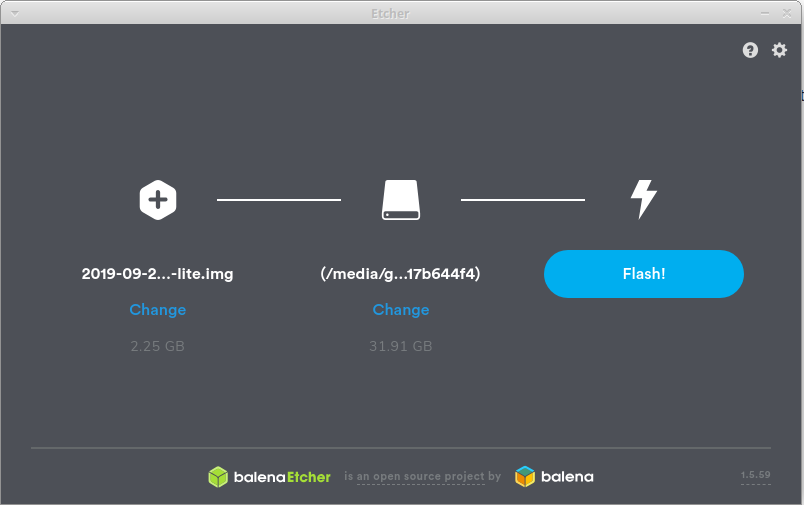
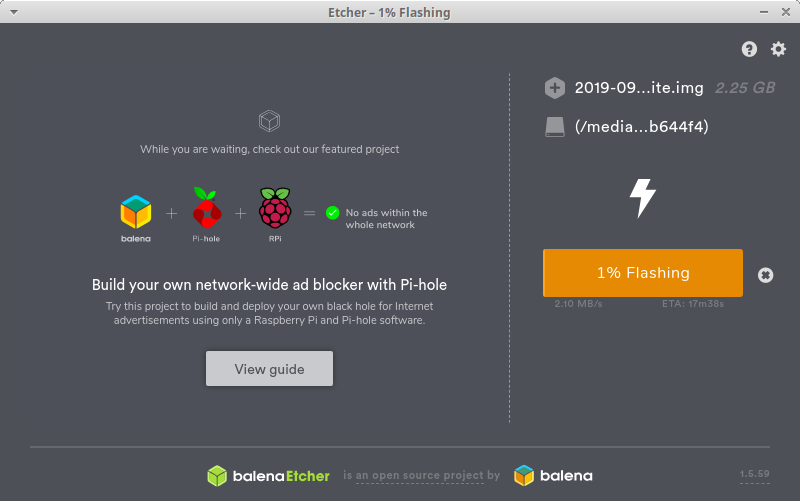
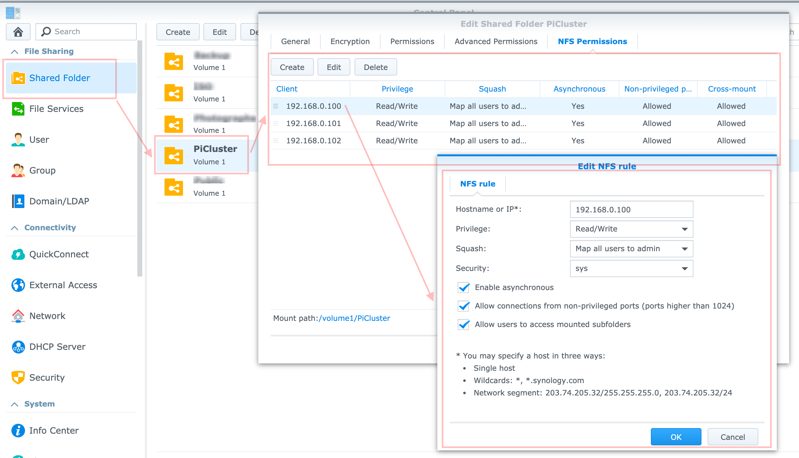

### (1/7) Pi setup

#### Install OS and prepare the system for Kubernetes

Fist of all, we need to install and configure the Linux Operating System on each node of the future Kubernetes cluster.

Our cluster will be composed of 3 (at the time of writing I had 3) machines.

| Hostname | IP | Description |
| -------- | -- | ----------- |
| kube-master | 192.168.0.100 | A Master represents the main node of the cluster responsible of the orchestration. It can act as a worker as well and run applications |
| kube-worker-1 | 192.168.0.101 | A Worker is a machine dedicated to run applications only. It is remotely managed by the master node |
| kube-worker-2 |192.168.0.102 | A Worker is a machine dedicated to run applications only. It is remotely managed by the master node |

> NOTE: 192.168.0.100 101 102 are the IP addresses I used on my cluster. Based on the network setup, these values could be different.

#### Flash the OS on the Micro SD card

1. Download the latest version of the Raspbian Linux / Ubuntu OS for RaspberryPi

Go to [the download page](https://www.raspberrypi.org/downloads/raspbian/) and download Raspbian Buster Lite.

Raspbian is a Debian-based computer operating system for Raspberry Pi.
Buster Lite is a minimal version of Raspbian that doesn't contain a Desktop or Recommended software. We can start from a very clean, light and fresh install using this version.

> [Ubuntu for IOT](https://ubuntu.com/download/raspberry-pi) can be used also. Ubuntu also has support fo x64.

2. Unzip the archive to obtain the image {name}.img

3. Plug an Micro SD Card into your local machine

4. Use Etcher and flash the image on the SD card

Download [Etcher](https://www.balena.io/etcher/) to flash OS images to SD cards & USB drives, safely and easily.

Launch Etcher, select first the image extracted of Raspbian, select the Media (SD card) and click on Flash.





5. Once flashed, navigate to the folder /boot of the SD card and create an empty file ssh

Adding the file named `ssh` onto the boot partition enables SSH by default.

```bash
cd /media/<USER_ID>/boot
touch ssh
```

6. Unplug the Micro SD Card from your local machine and plug it to the Raspberry Pi

7. Plug the power to the Raspberry Pi as well as an Ethernet cable

#### Power up and connect via SSH

1. Determine the device IP address

You can use your router or https://angryip.org/ or any IP discovery app you want.

Easiest to do is to run:

```bash
# This is for PI 4
arp -na | grep -i "dc:a6:32"

# This is to find older PI
# arp -na | grep -i "b8:27:eb"
```

2. Connect via SSH to the machine

> The default password after a fresh Raspbian installation is raspberry (this will be change after this step).

```bash
ssh pi@192.168.0.100
```

Test the other machines to make sure everything works.

#### Configure the OS

Before starting installing the Kubernetes cluster, we need to run a few common steps and security checks.

> THE FOLLOWING STEPS (6/6) SHOULD BE RUN ON ALL MACHINES

##### Step (1/6) Change password

```
pi@raspberrypi:~ passwd

Changing password for pi.
Current password: raspberry
New password: <new_password>
Retype new password: <new_password>
passwd: password updated successfully
```

##### Step (2/6) Change hostname

The default machine hostname is raspberrypi, keeping this could be quite confusing when we'd have two more machines with the same name. To change the hostname, two files needs to be edited:

1. Edit the file `/etc/hostname` and replace raspberrypi by `kube-master` or `kube-worker-x`.

```bash
sudo nano /etc/hostname

# kube-master or kube-worker-1,2...
```

2. Edit the file `/etc/hosts` and replace raspberrypi (line 6) by kube-master or kube-worker-x

```
pi@raspberrypi:~ $ sudo nano /etc/hosts

127.0.0.1       localhost
::1             localhost ip6-localhost ip6-loopback
ff02::1         ip6-allnodes
ff02::2         ip6-allrouters

127.0.1.1       kube-master
```

##### Step (3/6) Upgrade the system

To make sure, the system is up-to-date, run the following command to download the latest update and security patches.

> This step might take a few minutes.

```bash
sudo apt-get update && sudo apt-get upgrade -y
```

##### Step (4/6) Configure a static IP

By default, the router assigns a arbitrary IP address to the device which means it is highly possible that the router will assign a new different IP address after a reboot. To avoid to recheck our router, it is possible to assign a static IP to the machine.

Edit the file `/etc/dhcpcd.conf` and add the four lines below:

```
pi@raspberrypi:~ $ sudo nano /etc/dhcpcd.conf

interface eth0
static ip_address=192.168.0.{value}/24
static routers=192.168.0.1
static domain_name_servers=1.1.1.1
```

> Replace `{value}` with the machine IP address, ex: `static ip_address=192.168.0.100/24`

> The same should be done at router level. Block / Lock the IP address so that other devices could not get it from DHCP.

##### Step (5/6) Enable container features

We need to enable container features in the kernel in order to run containers.

[Raspbian] Edit the file `/boot/cmdline.txt`:
[UbuntuPI] Edit the file `/boot/firmware/cmdline.txt`:

```bash
sudo nano /boot/cmdline.txt
# or
sudo nano /boot/firmware/cmdline.txt
```

and add the following properties at the end of the line:

```
cgroup_enable=cpuset cgroup_memory=1 cgroup_enable=memory
```

##### Step (6/6) Restart and connect to the static IP with the new password and check the hostname.

```
pi@raspberrypi:~ $ sudo reboot

Connection to 192.168.0.22 closed by remote host.
Connection to 192.168.0.22 closed.
```

Reconnect after a few seconds

```bash
ssh pi@192.168.0.100
pi@192.168.0.22's password: <new_password>
```

Check if the hostname has been updated

```
pi@kube-master:~ $ hostname

kube-master
```

#### Configure the disk share (NFS)

If we need to connect a SSD to the master node and share it via NFS follow [these guidelines](https://kauri.io/install-raspbian-operating-system-and-prepare-the-system-for-kubernetes/7df2a9f9cf5f4f6eb217aa7223c01594/a) Configure the SSD disk share.

Bellow are details on how to set a NFS share on a Synology NAS for all machines.

> THE FOLLOWING STEPS (5/5) SHOULD BE RUN ON ALL MACHINES

##### Step (1/5) Create a mount folder

The NFS share will need a folder to be mounted on. Create the directory `/mnt/ssd` and set the ownership to `pi`.

```bash
sudo mkdir /mnt/ssd
sudo chown -R pi:pi /mnt/ssd/
```

##### Step (2/5) Create a NFS shared folder in Synology

Create a shared folder that will be used to host all filea coming from our cluster.


Enable NFS in File Services if not already done.


Under the shared folder properties set the NFS permissions for each machine individually making sure we set the correct properties as seen bellow.



##### Step (3/5) Install the necessary dependencies

```bash
sudo apt-get install nfs-common -y
```

##### Step (4/5) Configure auto-mount of the NFS Share

In this step, we will edit `/etc/fstab` to tell the OS to automatically mount the NFS share into the directory `/mnt/ssd` when the machine starts.

```bash
sudo nano /etc/fstab
```

Add the following line where `192.168.0.8:/volume1/PiCluster` is the IP of the NAS and the NFS share path.

```
192.168.0.8:/volume1/PiCluster   /mnt/ssd   nfs    rw  0  0
```

> For Synology all shared folders are located under `/volume1/{name of the folder}`

It should looks like this:

```
proc            /proc           proc    defaults          0       0
PARTUUID=738a4d67-01  /boot           vfat    defaults          0       2
PARTUUID=738a4d67-02  /               ext4    defaults,noatime  0       1
# a swapfile is not a swap partition, no line here
#   use  dphys-swapfile swap[on|off]  for that
192.168.0.8:/volume1/PiCluster   /mnt/ssd   nfs    rw  0  0
```

##### Step (5/5) Reboot the system

```bash
sudo reboot
```
