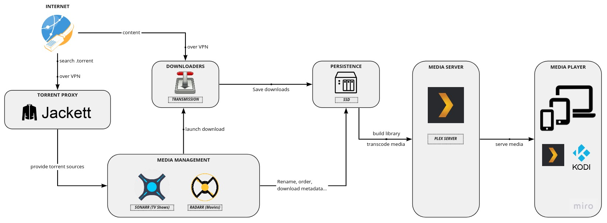
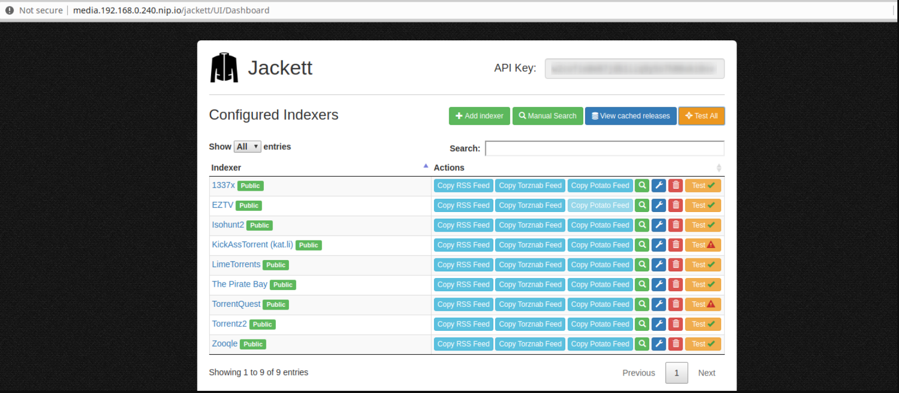
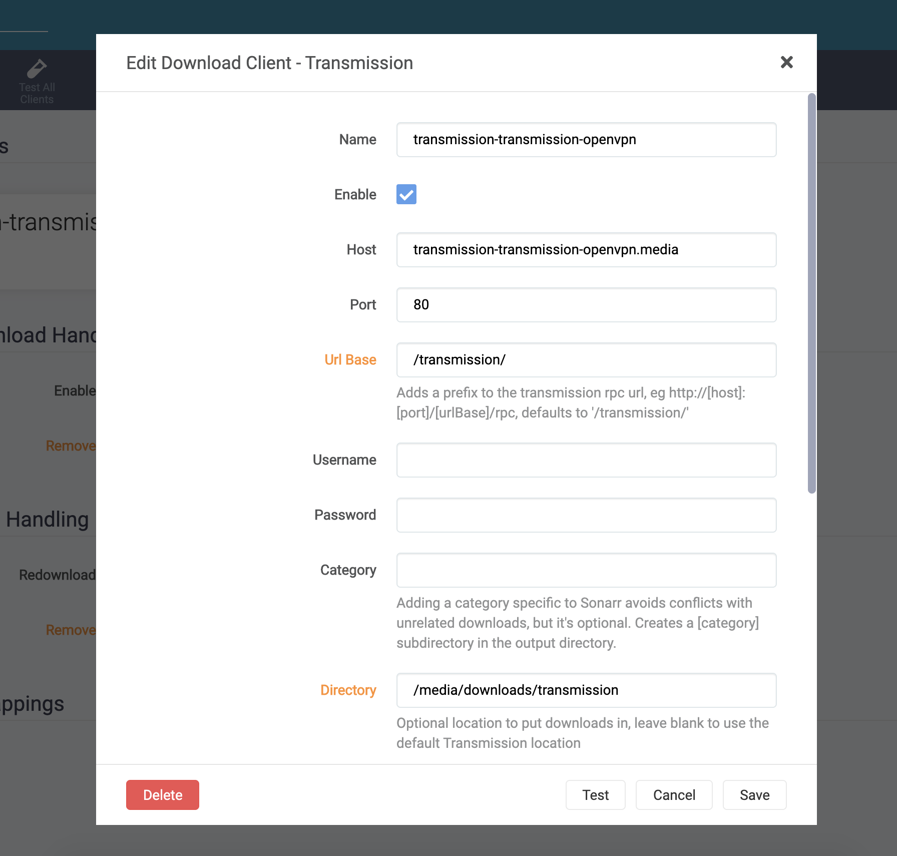
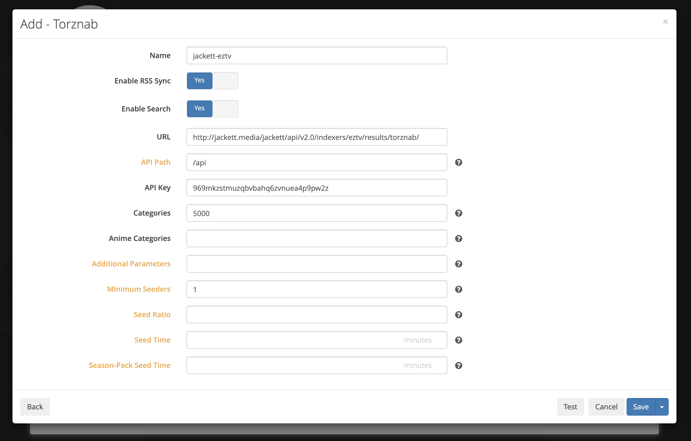

### (3/7) Self-host your Media Center On Kubernetes with Plex, Sonarr, Radarr, Transmission and Jackett

* **Persistence:** A dedicated volume on the SSD to store the data and files
* **Torrent Proxy:** Jackett is a Torrent Providers Aggregator tool helping to find efficiently BitTorent files over the web
* **Downloaders:** Transmission is a BitTorrent client to download the files
* **TV Show/Movie Media Management:** We'll use Sonarr and Radarr to automate the media aggregation. It searches, launches downloads and renames files when they go out
* **Media Center/Player:** Plex (server/player) will allow us to make our Media resources accessible from anywhere.



#### Namespace

We are going to isolate all the Kubernetes objects related to the Media Center into the namespace media.

To create a namespace, run the following command:

```bash
kubectl create namespace media
```

#### Persistence

**1. Deploy the Persistent Volume (PV)**

The Persistent Volume specifies the name, the size, the location and the access modes of the volume:

* The name of the PV is `media-ssd-volume`
* The size allocated is 200GB
* The location is `/mnt/ssd/media`
* The access is ReadWriteOnce

Create the following file and apply it to the k8 cluster.

```
# media.persistentvolume.yml
# Content: [cluster/base/common/media.persistentvolume.yml]
```

```bash
kubectl apply -f cluster/base/common/media.persistentvolume.yml

# persistentvolume/media-ssd-volume created
```

You can verify the PV exists with the following command:

```bash
kubectl get pv
```

**2. Create the Persistent Volume Claim (PVC)**

The Persistent Volume Claim is used to map a Persistent Volume to a deployment or stateful set. Unlike the PV, the PVC belongs to a namespace.

Create the following file and apply it to the k8 cluster.

```
# media.persistentvolumeclaim.yml
# Content: [cluster/base/common/media.persistentvolumeclaim.yml]
```

```bash
kubectl apply -f cluster/base/common/media.persistentvolumeclaim.yml

# persistentvolumeclaim/media-ssd-claim created
```

You can verify the PVC exists with the following command:

```bash
kubectl get pvc -n media
```

**3. Deploy and Create the Persistent Volume (PV)(PVC) for configs**

```bash
kubectl apply -f cluster/base/common/media-config.persistentvolume.yml
kubectl apply -f cluster/base/common/media-config.persistentvolumeclaim.yml
```

#### Ingress

After the persistent volume, we are now going to deploy the ingress responsible of making accessible a service from outside the cluster by mapping an internal `service:port` to a host. To choose a host, we need to configure a DNS like we did for NextCloud "nextcloud.<domain.com>" in the previous article. However, unlike NextCloud, the Media Center components have no reason to be exposed on the Internet, we can pick a host that will be resolved internally to our Nginx proxy (available at `192.168.0.240` : LoadBalancer IP). The simplest solution is to use [nip.io](https://nip.io/) which allows us to map an IP (in our case `192.168.0.240`) to a hostname without touching `/etc/hosts` or configuring a DNS. Basically it resolves `<anything>.<ip>.nip.io` by `<ip>` without requiring anything else, Magic !

**1. Create the file `media.ingress.yaml`**

Create the following Ingress config file media.ingress.yaml to map the routes to each service we will deploy right after this step:

* `http://media.192.168.0.240.nip.io/transmission` -> transmission-transmission-openvpn:80
* `http://media.192.168.0.240.nip.io/sonarr` -> sonarr:80
* `http://media.192.168.0.240.nip.io/jackett` -> jackett:80
* `http://media.192.168.0.240.nip.io/radarr` -> radarr:80
* `http://media.192.168.0.240.nip.io/tautulli` -> tautulli:80
* `http://media.192.168.0.240.nip.io/` -> plex-kube-plex:32400

**2. Deploy the ingress**

```bash
kubectl apply -f cluster/base/common/media.ingress.yaml

# ingress.extensions/media-ingress created
```

**3. Confirm the Ingress is correctly deployed**

Try the URL [http://media.192.168.0.240.nip.io](http://media.192.168.0.240.nip.io) from your browser and confirm it returns the error message 503 Service Temporarily Unavailable which is normal because we haven't deployed anything yet.

#### BitTorrent client - Transmission over VPN

The image [haugene/transmission-openvpn](https://haugene.github.io/docker-transmission-openvpn/) includes Transmission and supports a very large range of VPN providers (see [here](https://haugene.github.io/docker-transmission-openvpn/supported-providers/)) to obfuscate the traffic.

> ⚠️ **NOTE:** Before you beging create the following folders in the NAS NFS folder. These will be needed by the next steps.

```
.
├── media
├───── calibre
├───── configs
├──────── heimdall
├──────── jackett
├──────── plex
├──────── radarr
├──────── sonarr
├──────── tautulli
├──────── transmission-data
├───── downloads
├──────── jackett
├──────── transmission
├───── movies
└───── tv
```

**1. Create a Kubernetes secret to store your VPN password**

We first need to safely store our VPN Provider username and password into a [Kubernetes secret](https://kubernetes.io/docs/concepts/configuration/secret/). Run the command using your own VPN username and password:

```bash
kubectl create secret generic openvpn \
    --from-literal username=<VPN_USERNAME> \
    --from-literal password=<VPN_PASSWORD> \
    --namespace media
```

**2. Write the Helm configuration**

The default configuration can be seen by running the following command

```bash
helm show values bananaspliff/transmission-openvpn
```

Create the file `media.transmission-openvpn.values.yml` containing the following configuration.

```
# media.transmission-openvpn.values.yml
# Content: [cluster/base/media/transmission/media.transmission-openvpn.values.yml]
```

**3. Install the chart bananaspliff/transmission-openvpn**

Execute the following command to install the chart `bananaspliff/transmission-openvpn` with the above configuration onto the namespace `media`.

```bash
helm install transmission bananaspliff/transmission-openvpn \
    --values cluster/base/media/transmission/media.transmission-openvpn.values.yml \
    --namespace media
```

After a couple of minutes, you should observe a pod named transmission-transmission-openvpn-xxx Running.

```bash
kubectl get pods -n media -l app=transmission-openvpn -o wide

# NAME                                                 READY   STATUS    RESTARTS   AGE   IP           NODE           NOMINATED NODE   READINESS GATES
# transmission-transmission-openvpn-8446dbf97c-rzw5l   1/1     Running   0          29m   10.42.1.26   kube-worker1   <none>           <none>
```

**4. Access to Transmission Web console**

Now Transmission and the Nginx Ingress routes are deployed, you should be able to access the Transmission Web console via [http://media.192.168.0.240.nip.io/transmission](http://media.192.168.0.240.nip.io/transmission).

#### Torrent Providers Aggregator - Jackett

**1. Write the Helm configuration**

Create the file `media.jackett.values.yml` containing the following configuration.

```
# media.jackett.values.yml
# Content: [cluster/base/media/jackett/media.jackett.values.yml]
```

**2. Pre-configure Jackett**

> NOTE: This is an important step, if we don't do this, Nginx will not be able to route corecttly.

a. Create the following directory structure on your SSD/NFS folder.

```
media/configs/jackett/Jackett/
```

b. Create the file ServerConfig.json into the folder `media/configs/jackett/Jackett/` with the following content:

```
{
  "BasePathOverride": "/jackett"
}
```

**3. Install the chart k8s-at-home/jackett**

> NOTE: Make sure the folder structure above on the storage is created.

```bash
helm install jackett k8s-at-home/jackett \
    --values cluster/base/media/jackett/media.jackett.values.yml \
    --namespace media
```

After a couple of minutes, you should observe a pod named jackett-xxx Running.

```bash
kubectl get pods -n media -o wide

# NAME                      READY   STATUS    RESTARTS   AGE    IP           NODE           NOMINATED NODE   READINESS GATES
# jackett-6dc9c9dcf9-nwv5h                            1/1     Running   0          11m   10.42.0.19   kubemaster      <none>           <none>
```

**4. Access Jackett**

Go to Jackett on [http://media.192.168.0.240.nip.io/jackett](http://media.192.168.0.240.nip.io/jackett) and try to add one or more indexers.

#### [DEPRECATED] Torrent Providers Aggregator - Jackett over VPN

> NOTE: Skip if the normal version was done

[Jackett](https://github.com/Jackett/Jackett) is a Torrent Providers Aggregator which translates search queries from applications like Sonarr or Radarr into tracker-site-specific http queries, parses the html response, then sends results back to the requesting software. Because some Internet Providers might also block access to Torrent websites, I packaged a version of Jackett using a VPN connection (similar to transmission-over-vpn) accessible on [Docker hub - gjeanmart/jackettvpn:arm-latest](https://hub.docker.com/repository/docker/gjeanmart/jackettvpn).

**1. Write the Helm configuration**

Let's now configure the chart [bananaspliff/jackett](https://github.com/bananaspliff/geek-charts/tree/gh-pages/jackett). The default configuration can be seen by running the following command `$ helm show values bananaspliff/jackett`.

Create the file `media.jackett-openvpn.values.yml` containing the following configuration.

```
# media.jackett-openvpn.values.yml
# Content: [cluster/base/media/jackett/media.jackett-openvpn.values.yml]
```

**2. Configure VPN (only if you configured VPN_ENABLED=yes)**

a. Create the following directory structure on your SSD/NFS folder.

```
media/configs/jackett/openvpn/
```

b. Copy one OpenVPN file (usually provided by your VPN provider) into the folder `media/configs/jackett/openvpn/`.

c. Create a file credentials.conf into the folder `media/configs/jackett/openvpn/` composed of two line (first one: username and second one password)

```
<VPN_USERNAME>
<VPN_PASSWORD>
```

**3. Pre-configure Jackett**

a. Create the following directory structure on your SSD/NFS folder.

```
media/configs/jackett/Jackett/
```

b. Create the file ServerConfig.json into the folder `media/configs/jackett/Jackett/` with the following content:

```
{
  "BasePathOverride": "/jackett"
}
```

**4. Install the chart bananaspliff/jackett**

```bash
helm install jackett bananaspliff/jackett \
    --values media.jackett.values.yml \
    --namespace media
```

After a couple of minutes, you should observe a pod named jackett-xxx Running.

```bash
kubectl get pods -n media -l app=jackett -o wide

# NAME                      READY   STATUS    RESTARTS   AGE    IP           NODE           NOMINATED NODE   READINESS GATES
# jackett-864697466-69xwt   1/1     Running   0          101s   10.42.1.29   kube-worker1   <none>           <none>
```

**5. Access Jackett**

Go to Jackett on [http://media.192.168.0.240.nip.io/jackett](http://media.192.168.0.240.nip.io/jackett) and try to add one or more indexers.



#### TV Show Library Management - Sonarr

[Sonarr](https://sonarr.tv/) is a TV Show library management tool that offers multiple features:

* List all your episodes and see what's missing
* See upcoming episodes
* Automatically search last released episodes (via Jackett) and launch download (via Transmission)
* Move downloaded files into the right directory
* Notify when a new episodes is ready (Kodi, Plex)

**1. Write the Helm configuration**

Let's now configure the chart `k8s-at-home/sonarr`. The default configuration can be seen by running the following command `$ helm show values k8s-at-home/sonarr`.

Create the file `media.sonarr.values.yml` containing the following configuration.

```
# media.sonarr.values.yml
# Content: [cluster/base/media/sonarr/media.sonarr.values.yml]
```

**2. Pre-configure Sonarr**

Create the file `config.xml` into the folder `media/configs/sonarr/` (the NFS folder) with the following content:

```
<Config>
  <UrlBase>/sonarr</UrlBase>
</Config>
```

**3. Install the chart k8s-at-home/sonarr**

Execute the following command to install the chart `k8s-at-home/sonarr` with the above configuration onto the namespace `media`.

```bash
helm install sonarr k8s-at-home/sonarr \
    --values cluster/base/media/sonarr/media.sonarr.values.yml \
    --namespace media
```

After a couple of minutes, you should observe a pod named sonarr-xxx Running.

```bash
kubectl get pods -n media -o wide

# NAME                      READY   STATUS    RESTARTS   AGE     IP           NODE           NOMINATED NODE   READINESS GATES
# sonarr-574c5f85d7-n9jc6   1/1     Running   0          3m13s   10.42.1.30   kube-worker1   <none>           <none>
```

**4. Access Sonarr**

Go to Sonarr on [http://media.192.168.0.240.nip.io/sonarr](http://media.192.168.0.240.nip.io/sonarr) and start setting up the library automation. Refer to the [wiki](https://github.com/Sonarr/Sonarr/wiki) for more details.

**5. Configure Transmission**

Configure the connection to Transmission into **Settings / Download Client / Add (Transmission)**

* Using the hostname and port: `transmission-transmission-openvpn.media:80` ``
* Directory: `/media/downloads/transmission`

> Note: The folder /media, is the default volume mount for this Helm chart. The same volume mount should be used for Transmission also. Here is why:

```
Chart versions 3.2.0 and earlier used separate PVCs for Downloads and TV. This presented an issue where Sonarr would be unable to hard-link files between the /downloads and /tv directories when importing media. This is caused because each PVC is exposed to the pod as a separate filesystem. This resulted in Sonarr copying files rather than linking; using additional storage without the user's knowledge.

https://github.com/k8s-at-home/charts/tree/master/charts/sonarr
```



**6. Configure the connection to Jackett**

Configure the connection to Jackett into **Settings / Indexers / Add (Torznab / Custom)**

* Using the hostname and port: `jackett.media:80`



#### Movie Library Management - Radarr

[Radarr](https://radarr.video/) is a Movie library management tool that offers multiple features:

* List all your movies
* Search movies (via Jackett) and launch download (via Transmission)
* Move downloaded files into the right directory
* Notify when a new movie is ready (Kodi, Plex)

**1. Write the Helm configuration**

Let's now configure the chart `k8s-at-home/radarr`. The default configuration can be seen by running the following command `$ helm show values k8s-at-home/radarr`.

Create the file `media.radarr.values.yml` containing the following configuration.

```
# media.radarr.values.yml
# Content: [cluster/base/media/radarr/media.radarr.values.yml]
```

**2. Pre-configure Radarr**

Create the file `config.xml` into the folder `media/configs/radarr/` (the NFS folder) with the following content:

```
<Config>
  <UrlBase>/radarr</UrlBase>
</Config>
```

**3. Install the chart billimek/radarr**

Execute the following command to install the chart `k8s-at-home/radarr` with the above configuration onto the namespace `media`.

```bash
helm install radarr k8s-at-home/radarr \
    --values cluster/base/media/radarr/media.radarr.values.yml \
    --namespace media
```

After a couple of minutes, you should observe a pod named sonarr-xxx Running.

```bash
kubectl get pods -n media -o wide

# NAME                      READY   STATUS    RESTARTS   AGE     IP           NODE           NOMINATED NODE   READINESS GATES
# radarr-574c5f85d7-n9jc6   1/1     Running   0          3m13s   10.42.1.30   kube-worker1   <none>           <none>
```

**4. Access Radarr**

Go to Radarr on [http://media.192.168.0.240.nip.io/radarr](http://media.192.168.0.240.nip.io/radarr) and start setting up the library automation. Refer to the [wiki](https://github.com/Radarr/Radarr/wiki) for more details.

#### Media Server - Plex

[Plex Media Server](https://www.plex.tv/en-gb/) is a software to serve and stream your personal Media library (movies, TV show and music).

**1. Get a claim token**

Obtain a Plex Claim Token by visiting [plex.tv/claim](https://plex.tv/claim). You need to create an account if you haven't already one yet.

This will be used to bind your new PMS instance to your own user account automatically.

**2. Create the Helm config file media.plex.values.yml**

The default configuration can be seen by running the following command `$ helm show values k8s-at-home/plex`.

Create the file `media.plex.values.yml` containing the following configuration.

```
# media.plex.values.yml
# Content: [cluster/base/media/plex/media.plex.values.yml]
```

**3/A. Install the chart k8s-at-home/plex**

Execute the following command to install the chart `k8s-at-home/plex` with the above configuration onto the namespace `media`.

```bash
helm install plex k8s-at-home/plex \
    --values cluster/base/media/plex/media.plex.values.yml \
    --namespace media
```

**3/B. Upgrade the chart k8s-at-home/plex**

```bash
helm upgrade plex k8s-at-home/plex \
    --values cluster/base/media/plex/media.plex.values.yml \
    --namespace media
```

**4. Router config (outside access only)**

If you want to access remotely to your Media library, you will need to configure a port-forwarding to allow Plex to access your PMS.

Add a route to port-forward incoming requests on port `32400` to `192.168.0.241:32400` (Plex virtual IP assigned by MetalLB).

**5. Setup Plex**

Try now to access (from your network) to Plex Web Player on [http://192.168.0.241:32400](http://192.168.0.241:32400). You should see the setup wizard.

For outside access, you need to configure the external port used to map outside incoming requests to Plex. Go to Settings / Remote Access and check Manually specify the public to set the port 32400 (as configured in the router - Local).

*Notes*

* You can also access Plex from your local network via the ingress: http://media.192.168.0.240.nip.io/web
* Download the Android/iOS app and connect to your Plex account, you should automatically see your Plex Media Server with our your Media.

#### Tautulli Monitor your Plex Media Server

[Tautulli](https://tautulli.com/) is the best web application to monitor, view analytics, and receive notifications about your Plex Media Server.

**1. Create the Tautulli config file**

Create a `config.ini` file inside `configs/tautulli` NFS folder with the following:

```
[General]
http_root = "/tautulli"
```

**2. Create the Helm config file media.tautulli.values.yml**

```
# media.tautulli.values.yml
# Content: [cluster/base/media/tautulli/media.tautulli.values.yml]
```

**3/A. Install the chart k8s-at-home/tautulli**

```bash
helm install tautulli k8s-at-home/tautulli \
    --values cluster/base/media/tautulli/media.tautulli.values.yml \
    --namespace media
```

**3/B. Upgrade the chart**

```bash
helm upgrade tautulli k8s-at-home/tautulli \
    --values cluster/base/media/tautulli/media.tautulli.values.yml \
    --namespace media
```

**4. Access the UI and configure**

Access http://media.192.168.0.240.nip.io/tautulli/ and configure (user will be admin).
